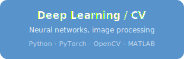
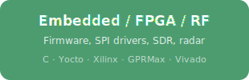
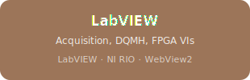
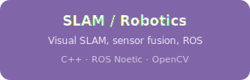
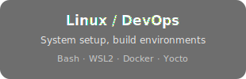
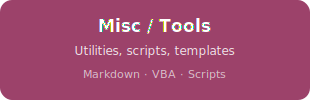

<h1 align="center">Ali Azam</h1>

  <em>MS Electrical Engineering Researcher · RFSoC · GPR · Deep Learning</em>

  
  
  
  

---

<h3 align="center">Repositories</h3>

  

  
  

  
  

  
  

---

<h3 align="center">GitHub Stats</h3>

  <picture>
    <source media="(prefers-color-scheme: dark)" srcset="https://github-readme-stats.vercel.app/api?username=aliaxam153&show_icons=true&theme=github_dark&hide_border=true&count_private=true" />
    <source media="(prefers-color-scheme: light)" srcset="https://github-readme-stats.vercel.app/api?username=aliaxam153&show_icons=true&theme=default&hide_border=true&count_private=true" />
    
  </picture>
  <picture>
    <source media="(prefers-color-scheme: dark)" srcset="https://streak-stats.demolab.com?user=aliaxam153&theme=github-dark-blue&hide_border=true" />
    <source media="(prefers-color-scheme: light)" srcset="https://streak-stats.demolab.com?user=aliaxam153&theme=default&hide_border=true" />
    
  </picture>

  <picture>
    <source media="(prefers-color-scheme: dark)" srcset="https://github-readme-stats.vercel.app/api/top-langs/?username=aliaxam153&layout=compact&theme=github_dark&hide_border=true&langs_count=8" />
    <source media="(prefers-color-scheme: light)" srcset="https://github-readme-stats.vercel.app/api/top-langs/?username=aliaxam153&layout=compact&theme=default&hide_border=true&langs_count=8" />
    
  </picture>

<h3 align="center">Contribution Graph</h3>

  <picture>
    <source media="(prefers-color-scheme: dark)" srcset="https://github-readme-activity-graph.vercel.app/graph?username=aliaxam153&theme=github-dark&hide_border=true&area=true" />
    <source media="(prefers-color-scheme: light)" srcset="https://github-readme-activity-graph.vercel.app/graph?username=aliaxam153&theme=github-light&hide_border=true&area=true" />
    
  </picture>

